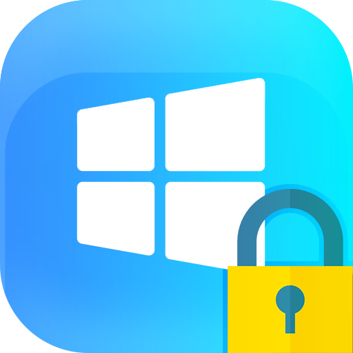

<!--
Readme template copied from https://github.com/othneildrew/Best-README-Template
-->

[![Contributors][contributors-shield]][contributors-url]
[![Forks][forks-shield]][forks-url]
[![Stargazers][stars-shield]][stars-url]
[![Issues][issues-shield]][issues-url]
[![MIT License][license-shield]][license-url]

<!-- PROJECT LOGO -->
 

  

<h3 align="center">Auto Winkey</h3>
  

    Automatically enable/disable the windows key when you're in a game or any app that is too busy for notifications.
     
     
    <a href="https://github.com/kdar/winkeylock/issues">Report Bug</a>
    ·
    <a href="https://github.com/kdar/winkeylock/issues">Request Feature</a>
  

<!-- TABLE OF CONTENTS -->

  
Table of Contents

  <ol>
    <li><a href="#about-the-project">About The Project</a></li>
    <li><a href="#installation">Installation</a></li>
    <li><a href="#usage">Usage</a></li>
    <li><a href="#contributing">Contributing</a></li>
    <li><a href="#license">License</a></li>
  </ol>

 

<!-- ABOUT THE PROJECT -->

## About The Project

The main motivation behind this project is preventing the windows key from ruining your gaming experience. I have a keyboard that has a windows key lock feature, but I always seem to forget to enable it before I go into a game. This program gives you a way of auto enabling/disabling the windows key during gaming, while also allowing you to continue to use the windows key in every day use.

(<a href="#top">back to top</a>)

## Installation

1. Download the [release](https://github.com/kdar/winkeylock/releases/latest).
2. Run

(<a href="#top">back to top</a>)

<!-- USAGE EXAMPLES -->

## Usage

Run the application and you should see the icon in the system tray. Now, hit the windows key outside of a game and the windows menu should come up. Do it inside of the game and it should be supressed! If it doesn't, please open an [issue](https://img.shields.io/github/issues).

(<a href="#top">back to top</a>)

<!-- CONTRIBUTING -->

## Contributing

Contributions are what make the open source community such an amazing place to learn, inspire, and create. Any contributions you make are **greatly appreciated**.

If you have a suggestion that would make this better, please fork the repo and create a pull request. You can also simply open an issue with the tag "enhancement".
Don't forget to give the project a star! Thanks again!

1. Fork the Project
2. Create your Feature Branch (`git checkout -b feature/AmazingFeature`)
3. Commit your Changes (`git commit -m 'Add some AmazingFeature'`)
4. Push to the Branch (`git push origin feature/AmazingFeature`)
5. Open a Pull Request

(<a href="#top">back to top</a>)

<!-- LICENSE -->

## License

Distributed under the MIT License. See `LICENSE` for more information.

(<a href="#top">back to top</a>)

<!-- MARKDOWN LINKS & IMAGES -->
<!-- https://www.markdownguide.org/basic-syntax/#reference-style-links -->

[contributors-shield]: https://img.shields.io/github/contributors/kdar/winkeylock.svg?style=for-the-badge
[contributors-url]: https://github.com/kdar/winkeylock/graphs/contributors
[forks-shield]: https://img.shields.io/github/forks/kdar/winkeylock.svg?style=for-the-badge
[forks-url]: https://github.com/kdar/winkeylock/network/members
[stars-shield]: https://img.shields.io/github/stars/kdar/winkeylock.svg?style=for-the-badge
[stars-url]: https://github.com/kdar/winkeylock/stargazers
[issues-shield]: https://img.shields.io/github/issues/kdar/winkeylock.svg?style=for-the-badge
[issues-url]: https://github.com/kdar/winkeylock/issues
[license-shield]: https://img.shields.io/github/license/kdar/winkeylock.svg?style=for-the-badge
[license-url]: https://github.com/kdar/winkeylock/blob/master/LICENSE
[product-screenshot]: images/screenshot.png
